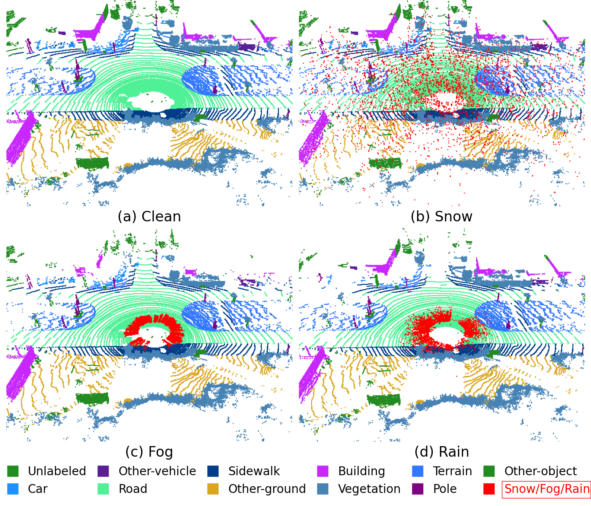
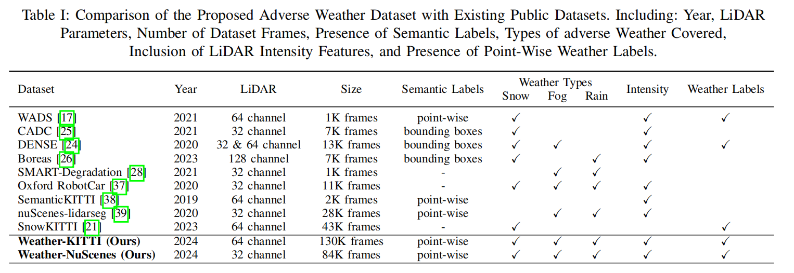
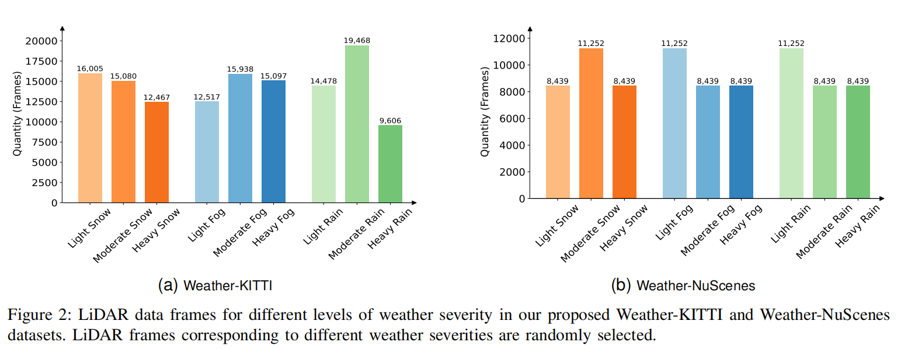
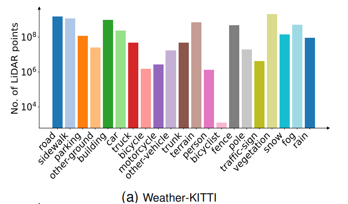
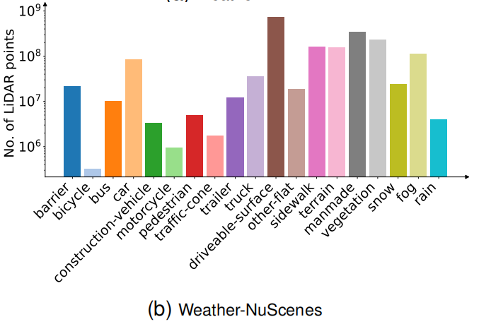
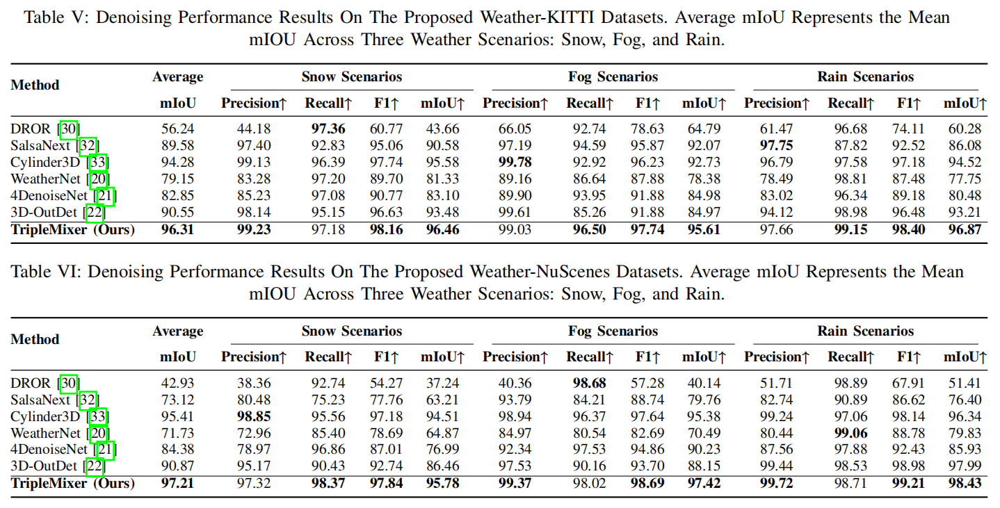

[](https://www.arxiv.org/abs/2408.13802)
[](https://github.com/Grandzxw/TripleMixer)


# TripleMixer: A 3D Point Cloud Denoising Model for Adverse Weather

This is the official repository of the **Weather-KITTI** and **Weather-NuScenes** dataset. For technical details, please refer to:

**TripleMixer: A 3D Point Cloud Denoising Model for Adverse Weather** <br />
[Xiongwei Zhao*](https://github.com/Grandzxw), [Congcong Wen*](https://scholar.google.com.sg/citations?user=OTBgvCYAAAAJ&hl=zh-CN&oi=ao), Yang Wang, 
[Haojie Bai](https://www.researchgate.net/profile/Haojie-Bai), [Wenhao Dou](https://scholar.google.com.sg/citations?user=WMyb00gAAAAJ&hl=zh-CN&oi=ao). <br />

**[[Paper](https://www.arxiv.org/abs/2408.13802)] [[Blog]()][[Download]()] ** <br />

### 1. Dataset

#### (1) Overview

In this Work, we propose our synthetic adverse weather datasets, named **Weather-KITTI** and **Weather-NuScenes**, which are based on the [SemanticKITTI](https://www.semantic-kitti.org/) and [nuScenes-lidarseg](https://www.nuscenes.org/) datasets, respectively. These datasets cover three common adverse weather conditions: rain, fog, and snow and retain the original LiDAR acquisition information and provide point-level semantic labels for rain, fog, and snow.

<p align="center">  </p>
<p align="center">  </p>


#### (2) Dataset Statistics

<p align="center">  </p>

<table border="0">
  <tr>
    <td></td>
    <td></td>
  </tr>
</table>


### 2. Quantitative Result of Denoising Task
<p align="center">  </p>


### 3. Training and Evaluation

Continuous Updates！


### Citation
If you find our work useful in your research, please consider citing:
```bibtex
@misc{zhao2024triplemixer3dpointcloud,
      title={TripleMixer: A 3D Point Cloud Denoising Model for Adverse Weather}, 
      author={Xiongwei Zhao and Congcong Wen and Yang Wang and Haojie Bai and Wenhao Dou},
      year={2024},
      eprint={2408.13802},
      archivePrefix={arXiv},
      primaryClass={cs.CV},
      url={https://arxiv.org/abs/2408.13802}, 
}
```


### Updates
* 24/08/2024: Initial release and submitted to the Journal. The dataset will be open source soon!


### License
The dataset is based on the [SemanticKITTI](https://www.semantic-kitti.org/) dataset, provided under the [Creative Commons Attribution-NonCommercial-ShareAlike 3.0 United States License (CC BY-NC-SA 3.0 US)](https://creativecommons.org/licenses/by-nc-sa/3.0/us/), and the [nuScenes-lidarseg](https://www.nuscenes.org/) dataset, provided under the [Creative Commons Attribution-NonCommercial-ShareAlike 4.0 International License (CC BY-NC-SA 4.0)](https://creativecommons.org/licenses/by-nc-sa/4.0/). This dataset is provided under the terms of the [Creative Commons Attribution-NonCommercial-ShareAlike 4.0 International License (CC BY-NC-SA 4.0)](https://creativecommons.org/licenses/by-nc-sa/4.0/).
